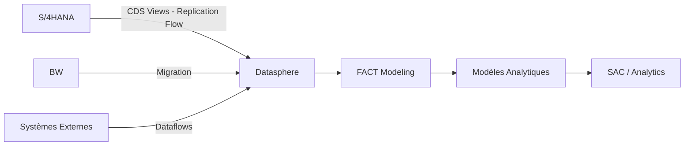

# SAP Datasphere

## Vue d'ensemble

SAP Datasphere est la solution de data warehousing moderne de SAP, combinant les capacités de :

- SAP DataSphere 
- SAP BW Bridge (pour migration BW)
- Intégration native S/4HANA

## Architecture


## Composants Clés

### 1. Spaces
Environnements isolés pour organiser les données par projet ou département.

### 2. Connexions
- Remote Tables
- Replications
- Dataflows

### 3. Couches de Données

!!! info "Architecture en couches"
    - **Bronze Layer** : Données sources brutes
    - **Silver Layer** : Données nettoyées et standardisées
    - **Semantic/Gold Layer** : Modèles analytiques business

### 4. Modèles Analytiques
- Analytical Datasets
- Perspectives
- Dimensions réutilisables

## Cas d'Usage Typiques

=== "Extraction S/4HANA"
```sql
    -- Exemple : Extraction données production
    SELECT
        AUFNR,           -- Ordre de fabrication
        MATNR,           -- Matière
        GMEIN,           -- Unité
        MENGE,           -- Quantité
        BUDAT            -- Date comptable
    FROM AFPO
    WHERE BUDAT >= ADD_YEARS(CURRENT_DATE, -2)
```

=== "Transformation SQL"
```sql
    -- Calcul stock valorisé
    SELECT 
        t1.MATNR,
        t1.WERKS,
        t1.LGORT,
        SUM(t1.LABST) as STOCK_QTY,
        t2.STPRS as PRIX_STANDARD,
        SUM(t1.LABST * t2.STPRS) as VALEUR_STOCK
    FROM MARD t1
    LEFT JOIN MBEW t2 
        ON t1.MATNR = t2.MATNR 
        AND t1.WERKS = t2.BWKEY
    GROUP BY t1.MATNR, t1.WERKS, t1.LGORT, t2.STPRS
```

## Bonnes Pratiques

!!! success "Recommandations"
    1. **Nommage** : Utiliser des préfixes clairs (DIM_, FACT_, VIEW_)
    2. **Performance** : Créer des index sur les clés de jointure
    3. **Documentation** : Toujours renseigner les descriptions business
    4. **Versioning** : Utiliser Git pour les JSON exports

!!! warning "Pièges à éviter"
    - Ne pas mélanger données temps réel et répliquées dans un même modèle
    - Éviter les jointures sur des Remote Tables volumineuses
    - Limiter la profondeur des hiérarchies (max 5 niveaux)

## Voir Aussi

- [Modèles Analytiques](modeles-analytiques.md)
- [Dataflows](dataflows.md)
- [Migration depuis BW](../bw/migration-datasphere.md)