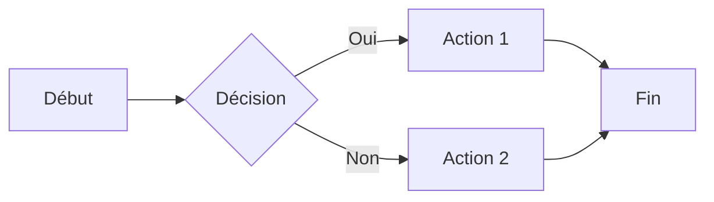
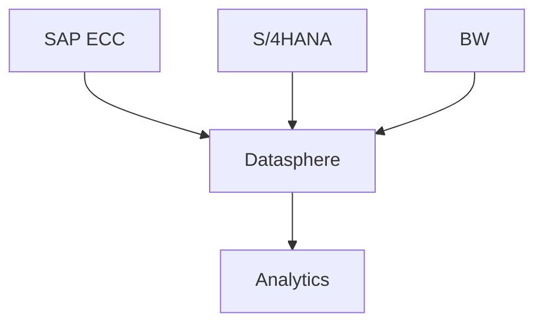
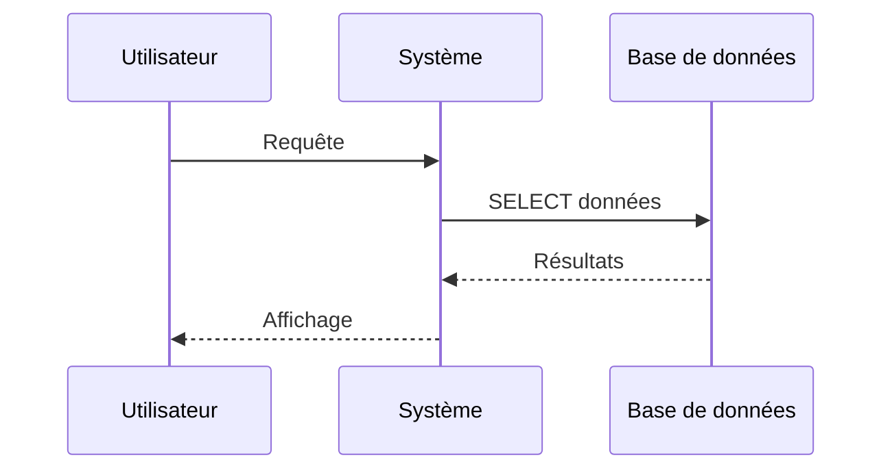
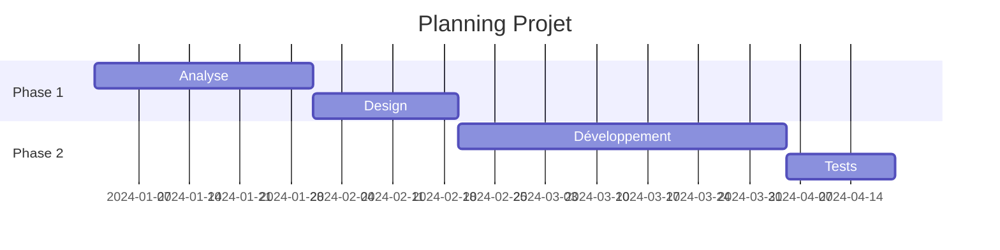
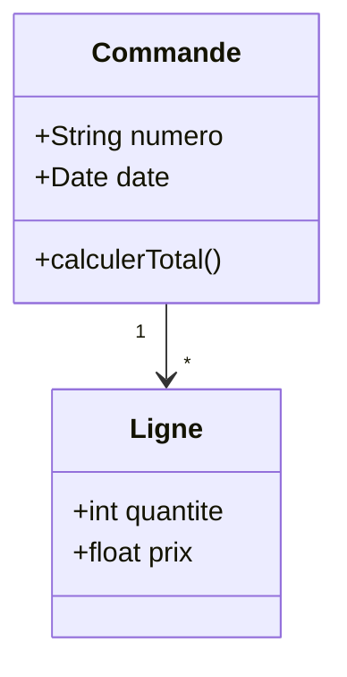
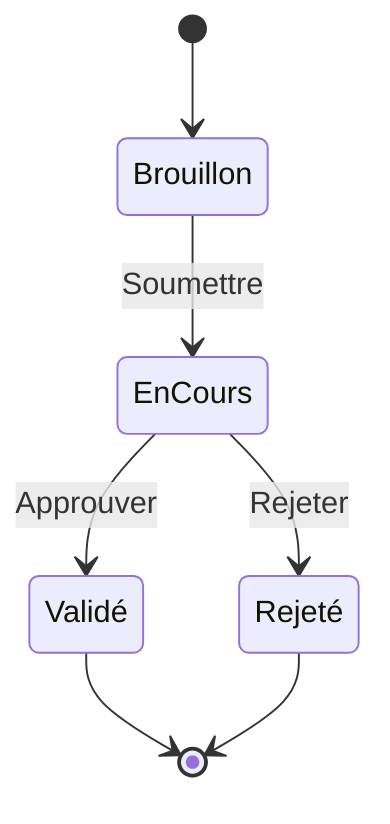
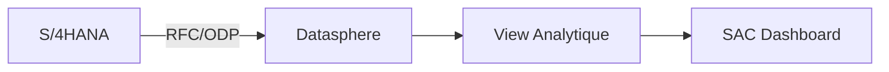

# MkDocs Material - Cheat Sheet Markdown

Guide de référence rapide pour toutes les syntaxes Markdown supportées par MkDocs Material.

---

## 📝 Formatage de Texte Basique

### Emphase et Style

```markdown
*Italique* ou _italique_
**Gras** ou __gras__
***Gras et italique*** ou ___gras et italique___
~~Texte barré~~
`Code inline`
==Texte surligné==
```

**Rendu :**
- *Italique*
- **Gras**
- ***Gras et italique***
- ~~Texte barré~~
- `Code inline`
- ==Texte surligné==

---

## 📑 Titres

```markdown
# Titre niveau 1
## Titre niveau 2
### Titre niveau 3
#### Titre niveau 4
##### Titre niveau 5
###### Titre niveau 6
```

**Alternative avec soulignement :**
```markdown
Titre niveau 1
==============

Titre niveau 2
--------------
```

---

## 🔗 Liens

### Liens standards
```markdown
[Texte du lien](https://example.com)
[Lien avec titre](https://example.com "Titre au survol")
<https://example.com>
```

### Liens internes (entre pages MkDocs)
```markdown
[Voir la page SQL](sql/patterns.md)
[Section spécifique](datasphere/index.md#architecture)
[Remonter d'un niveau](../bw/index.md)
```

### Liens avec ancres
```markdown
[Aller à la section](#nom-de-section)
```

### Liens de référence
```markdown
[Texte du lien][1]
[Autre lien][ref]

[1]: https://example.com
[ref]: https://autre-site.com "Titre optionnel"
```

---

## 🖼️ Images

### Image simple
```markdown


```

### Image avec titre
```markdown

```

### Image avec lien
```markdown
[](https://lien-destination.com)
```

### Image avec alignement et taille
```markdown
{ width="300" }
{ align=left }
{ loading=lazy }
```

---

## 📋 Listes

### Liste non ordonnée
```markdown
- Item 1
- Item 2
  - Sous-item 2.1
  - Sous-item 2.2
- Item 3

* Alternative avec astérisque
+ Alternative avec plus
```

### Liste ordonnée
```markdown
1. Premier item
2. Deuxième item
   1. Sous-item 2.1
   2. Sous-item 2.2
3. Troisième item
```

**Astuce :** Vous pouvez utiliser `1.` pour tous les items, la numérotation sera automatique.

### Liste de définitions
```markdown
Terme 1
:   Définition du terme 1

Terme 2
:   Définition du terme 2
    Avec plusieurs lignes
```

### Liste de tâches
```markdown
- [x] Tâche terminée
- [ ] Tâche en cours
- [ ] Tâche à faire
```

---

## 💬 Citations

### Citation simple
```markdown
> Ceci est une citation
> sur plusieurs lignes
```

### Citation imbriquée
```markdown
> Citation niveau 1
>> Citation niveau 2
>>> Citation niveau 3
```

### Citation avec attribution
```markdown
> La simplicité est la sophistication suprême.
>
> — Léonard de Vinci
```

---

## 💻 Blocs de Code

### Code inline
```markdown
Utilisez la fonction `SELECT * FROM table` en SQL.
```

### Bloc de code sans coloration
```markdown
    Code indenté de 4 espaces
    Deuxième ligne
```

Ou avec triple backticks :
````markdown
```
Code sans coloration syntaxique
```
````

### Bloc de code avec coloration syntaxique

````markdown
```python
def hello_world():
    print("Hello, World!")
```
````

````markdown
```sql
SELECT 
    MATNR,
    MAKTX,
    MEINS
FROM MARA
WHERE MTART = 'FERT'
ORDER BY MATNR;
```
````

````markdown
```javascript
function greet(name) {
    return `Hello, ${name}!`;
}
```
````

### Code avec numéros de ligne
````markdown
```python linenums="1"
def fibonacci(n):
    if n <= 1:
        return n
    return fibonacci(n-1) + fibonacci(n-2)
```
````

### Code avec lignes surlignées
````markdown
```python hl_lines="2 3"
def calculate_total(items):
    total = 0  # Cette ligne sera surlignée
    for item in items:  # Cette ligne aussi
        total += item.price
    return total
```
````

### Code avec titre
````markdown
```python title="fibonacci.py"
def fibonacci(n):
    return n if n <= 1 else fibonacci(n-1) + fibonacci(n-2)
```
````

---

## 📊 Tableaux

### Tableau simple
```markdown
| Colonne 1 | Colonne 2 | Colonne 3 |
|-----------|-----------|-----------|
| Ligne 1   | Donnée A  | Donnée X  |
| Ligne 2   | Donnée B  | Donnée Y  |
| Ligne 3   | Donnée C  | Donnée Z  |
```

### Tableau avec alignement
```markdown
| Gauche | Centré | Droite |
|:-------|:------:|-------:|
| Texte  | Texte  | Texte  |
| 123    | 456    | 789    |
```

**Alignement :**
- `:---` = Aligné à gauche (défaut)
- `:---:` = Centré
- `---:` = Aligné à droite

### Tableau avec formatage
```markdown
| Fonctionnalité | Status | Description |
|----------------|--------|-------------|
| **Feature A**  | ✅ OK  | *Implémenté* |
| **Feature B**  | ⚠️ WIP | En cours |
| **Feature C**  | ❌ KO  | `Non disponible` |
```

---

## 📦 Admonitions (Boîtes d'Information)

### Types disponibles

```markdown
!!! note
    Ceci est une note simple.

!!! note "Titre personnalisé"
    Note avec titre personnalisé.

!!! abstract
    Résumé ou abstract

!!! info
    Information générale

!!! tip
    Astuce ou conseil

!!! success
    Message de succès

!!! question
    Question ou aide

!!! warning
    Avertissement

!!! failure
    Échec ou erreur

!!! danger
    Danger ou critique

!!! bug
    Bug ou problème

!!! example
    Exemple

!!! quote
    Citation
```

### Admonition repliable
```markdown
??? note "Cliquez pour déplier"
    Contenu masqué par défaut.

???+ note "Déplié par défaut"
    Contenu visible par défaut, mais repliable.
```

### Admonition sans titre
```markdown
!!! note ""
    Boîte sans titre.
```

### Admonition inline
```markdown
!!! info inline end
    Boîte flottante à droite du texte.

Votre texte continue ici et entoure la boîte d'information.
```

---

## 🎨 Onglets de Contenu

### Onglets simples
```markdown
=== "Tab 1"
    Contenu du premier onglet.

=== "Tab 2"
    Contenu du deuxième onglet.

=== "Tab 3"
    Contenu du troisième onglet.
```

### Onglets avec code
```markdown
=== "Python"
    ```python
    print("Hello, World!")
    ```

=== "JavaScript"
    ```javascript
    console.log("Hello, World!");
    ```

=== "SQL"
    ```sql
    SELECT 'Hello, World!' FROM DUAL;
    ```
```

### Onglets imbriqués
```markdown
=== "Niveau 1 - Option A"
    
    === "Sous-option A1"
        Contenu A1
    
    === "Sous-option A2"
        Contenu A2

=== "Niveau 1 - Option B"
    Contenu B
```

---

## 📐 Diagrammes Mermaid

### Graphique de flux
````markdown

````

### Graphique vertical
````markdown

````

### Diagramme de séquence
````markdown

````

### Diagramme de Gantt
````markdown

````

### Diagramme de classes
````markdown

````

### Diagramme d'état
````markdown

````

---

## 🔢 Formules Mathématiques (LaTeX)

### Inline
```markdown
L'équation $E = mc^2$ est célèbre.
```

### Bloc
```markdown
$$
\frac{n!}{k!(n-k)!} = \binom{n}{k}
$$
```

### Exemples courants
```markdown
$$
\sum_{i=1}^{n} x_i = x_1 + x_2 + \cdots + x_n
$$

$$
\int_{a}^{b} f(x)dx
$$

$$
\sqrt{x^2 + y^2}
$$
```

---

## 🎯 Annotations de Code

### Avec numéros
````markdown
```python
def process_data(data):  # (1)!
    result = []
    for item in data:  # (2)!
        result.append(item * 2)
    return result  # (3)!
```

1. Cette fonction traite les données
2. Boucle sur chaque élément
3. Retourne le résultat final
````

### Avec icônes
````markdown
```sql
SELECT 
    MATNR,  -- (1)!
    MAKTX,  -- (2)!
    MEINS   -- (3)!
FROM MARA
```

1. :material-barcode: Numéro de matière
2. :material-text: Désignation
3. :material-scale-balance: Unité de mesure
````

---

## 🔗 Notes de Bas de Page

```markdown
Voici un texte avec une note[^1].

Autre texte avec une note[^note-longue].

[^1]: Ceci est la note de bas de page.

[^note-longue]: 
    Note de bas de page avec plusieurs paragraphes.
    
    Deuxième paragraphe de la note.
```

---

## ✂️ Détails Repliables

```markdown
<details>
<summary>Cliquez pour voir les détails</summary>

Contenu masqué par défaut.

- Item 1
- Item 2

```python
print("Code caché")
```

</details>
```

---

## 🎨 Icônes et Emojis

### Emojis standards
```markdown
😀 😃 😄 😁 🎉 🚀 ✅ ❌ ⚠️ 💡 📝 🔧
```

### Icônes Material Design
```markdown
:material-account: - Compte utilisateur
:material-check: - Validation
:material-close: - Fermer
:material-alert: - Alerte
:fontawesome-brands-github: - GitHub
:fontawesome-solid-heart: - Cœur
```

**Recherche d'icônes :** https://squidfunk.github.io/mkdocs-material/reference/icons-emojis/

---

## 🎨 Boutons

```markdown
[Bouton Simple](#){ .md-button }

[Bouton Principal](#){ .md-button .md-button--primary }

[Télécharger :fontawesome-solid-download:](#){ .md-button }
```

---

## 📐 Grilles et Cartes

### Grille simple
```markdown
<div class="grid cards" markdown>

- :material-clock-fast: **Installation rapide**

    ---
    
    Installez en quelques minutes
    
    [:octicons-arrow-right-24: Démarrer](getting-started.md)

- :material-book-open: **Documentation**

    ---
    
    Documentation complète
    
    [:octicons-arrow-right-24: Lire](reference.md)

</div>
```

---

## 📋 Attributs HTML

### Sur images
```markdown
{ width="300" loading=lazy }
```

### Sur liens
```markdown
[Lien](url){ target="_blank" }
```

### Sur paragraphes
```markdown
Paragraphe avec style.
{ .custom-class }
```

---

## 🎯 Front Matter (Métadonnées)

En haut de chaque fichier .md :

```markdown
---
title: Titre personnalisé de la page
description: Description pour SEO et social cards
icon: material/star
status: new
tags:
  - datasphere
  - sql
  - migration
---

# Contenu de la page
```

---

## 🔤 Caractères Spéciaux

### Échappement
```markdown
\* Pas d'italique
\_ Pas de soulignement
\# Pas de titre
\[ Pas de lien
\` Pas de code
```

### Espaces insécables
```markdown
100&nbsp;km
M.&nbsp;Dupont
```

### Trait horizontal
```markdown
---
ou
***
ou
___
```

---

## 📊 Exemple Complet SAP

Voici un exemple complet utilisant plusieurs fonctionnalités :

```markdown
# Extraction Données Production S/4HANA

## Vue d'ensemble

Ce document détaille l'extraction des données de **production** depuis SAP S/4HANA vers Datasphere.

!!! info "Prérequis"
    - Accès S/4HANA avec profil SAP_ALL
    - Space Datasphere configuré
    - Connexion RFC active

## Architecture



## Tables Sources

=== "Ordres de Fabrication"

    | Table | Description |
    |-------|-------------|
    | AUFK  | En-tête ordre |
    | AFKO  | Données ordre |
    | AFPO  | Postes ordre |

=== "Stocks"

    | Table | Description |
    |-------|-------------|
    | MARD  | Stocks magasin |
    | MBEW  | Valorisation |
    | MSKA  | Stocks commande |

## Requête SQL

```sql
-- Extraction ordres de fabrication
SELECT 
    h.AUFNR as ORDRE_FABRICATION,        -- (1)!
    h.AUART as TYPE_ORDRE,
    h.WERKS as SITE,
    p.MATNR as MATERIEL,                 -- (2)!
    p.MENGE as QUANTITE,
    h.GSTRS as DATE_DEBUT,
    h.GLTRS as DATE_FIN
FROM AUFK h
INNER JOIN AFPO p 
    ON h.AUFNR = p.AUFNR
WHERE h.AUART = 'PP01'                   -- (3)!
  AND h.GSTRS >= ADD_MONTHS(CURRENT_DATE, -12)
ORDER BY h.GSTRS DESC;
```

1. :material-barcode: Numéro unique de l'ordre
2. :material-package-variant: Code article fabriqué
3. :material-filter: Filtre sur ordres production uniquement

## Points d'Attention

!!! warning "Performance"
    Table AFPO volumineuse : toujours filtrer sur date

!!! tip "Optimisation"
    Créer un index sur (AUART, GSTRS) pour améliorer les performances

## Checklist Déploiement

- [x] Connexion S/4HANA validée
- [x] Tables répliquées dans Datasphere
- [ ] Tests de volumétrie effectués
- [ ] Documentation utilisateur créée

## Voir Aussi

- [Tables Clés S/4HANA](../s4hana/tables-cles.md)
- [Optimisation SQL](../sql/optimisation.md)
- [Projet BAREGLASS](../projets/bareglass.md)

---

*Dernière mise à jour : 2024-12-03*
*Auteur : André | Tags : #s4hana #production #extraction*
```

---

## 🎓 Ressources

- **Documentation officielle MkDocs Material :** https://squidfunk.github.io/mkdocs-material/reference/
- **Markdown Guide :** https://www.markdownguide.org/
- **Mermaid Diagrams :** https://mermaid.js.org/
- **Material Icons :** https://materialdesignicons.com/

---

## 💡 Astuces Finales

1. **Prévisualisation en temps réel** : Utilisez `mkdocs serve` et gardez votre navigateur ouvert
2. **Validation YAML** : Utilisez l'extension YAML dans VSCode pour valider mkdocs.yml
3. **Recherche d'icônes** : https://squidfunk.github.io/mkdocs-material/reference/icons-emojis/#search
4. **Templates** : Créez des templates de pages pour standardiser votre documentation
5. **Git** : Versionnez votre documentation dès le début

---

**Bon courage avec votre documentation SAP ! 🚀**
